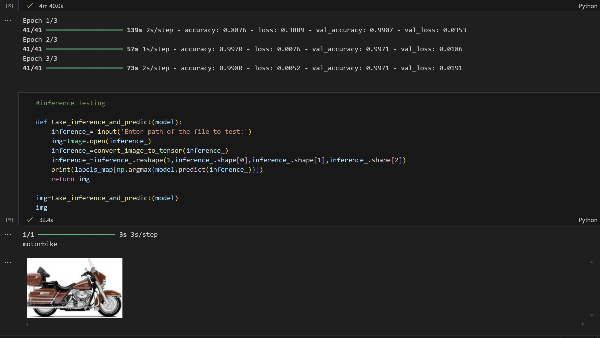

# Object_Image_Classifier-using-Tensorflow
This is a model trained on the dataset from Kaggle (Natural Image)
https://www.kaggle.com/datasets/prasunroy/natural-images?resource=download

which will classify if the given image is one of the object form the trained data 
ie.  airplane, cat, dog, flower ... etc

